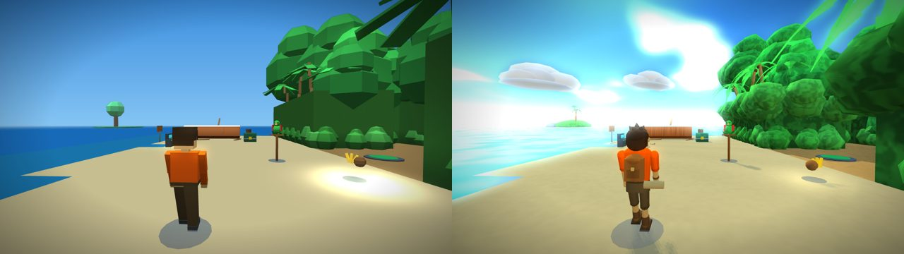
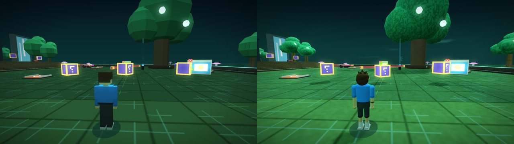

# 3D Visual Foundation

A small, reusable kit that gives browser 3D school games a polished, stylized look: rounded shapes, warm sun with real shadows, a painted sky with clouds, animated water, and automatic grass, sand, wood and rock detail. It's made for the **Game Kit** single-file games on this site (Island Escape, SHRUNK!, Cyber Rush…) and also works on any plain WebGL page.

- No engine, no build step, no npm.
- Plain classic `<script>` files, so games still run offline from `file://`.
- WebGL 1, so it runs on old lab PCs.
- About 155 KB of code and data in total.

Used in:
- **`Tool_G6-7_Island_Escape.html`**: the full style (see "What changed in Island Escape" below)
- **`Tool_G8-9_Cyber_Rush.html`**: same renderer and characters, neon worlds kept (see "What changed in Cyber Rush")

## Contents
| Path | What it is |
|---|---|
| `src/gk-renderer.js` | **The renderer.** Drop-in replacement for the Game Kit's `game-types/first-person-3d/renderer.js`. Same API, plus: sky dome and clouds, sun shadow map, auto materials, water, filmic tone, rim light, `setSkyProps`, `setShadowFocus`, `adapt()` (lowers quality on slow PCs) |
| `src/gk-geo.js` | **Geometry builder.** Drop-in replacement for `game-types/_spatial/geometry.js`: smooth normals for spheres and cylinders, `blob()` (lumpy sphere), `addData()` (imported models), `noTop` caps |
| `src/stylized-nature.js` | Nature models: `palm`, `bush`, `canopy`, `fern`, `bigTree`, `kenneyTree`, `grassTuft`, `flowerPatch`, `pebbles`, `seaRock`, `cliffRock`, `mountain`, `island`, `skyCloud`. Load it after the kit's model files: same names replace the old flat ones |
| `src/stylized-characters.js` | A rounded explorer for the kit's animated `hero` / `heroPart` (big head and eyes, scarf, backpack). Same joints as `GK.HERO` |
| `src/lighting-presets.js` | `GK.LightingPresets`: `tropicalDay`, `goldenHour`, `storm`, `cave`, `neonNight`, `indoorLab` |
| `src/gk-core-math.js` | The bits of the kit core the files above need (colour helpers, vectors, mat4, model registry). Only for projects **without** the Game Kit |
| `assets/kenney-models.js` | Kenney CC0 grass tufts and a tree, converted to vertex-coloured data (`GK.ModelData`). 35 KB |
| `assets/models/` | The original Kenney `.glb` files, colour maps and licence notes (kept so they can be reconverted) |
| `tools/glb_to_geo.py` | Converts small `.glb` models (Kenney or Quaternius style) into `GK.ModelData` scripts. Python 3 + Pillow |
| `tools/inline_blocks.py` | Puts `src/` files inside a single-file Game Kit game as named `<script>/* … */` blocks (re-runnable) |
| `examples/island-demo.html` | A standalone page that uses only this folder: a little island with presets and a low-graphics toggle. Open it straight from disk |
| `ART_DIRECTION.md` | Visual rules: shapes, palette, light, budgets |
| `INTEGRATION_GUIDE.md` | How to add this to another game (Game Kit or not) |
| `PROMPT_TEMPLATE.md` | A short prompt to give Claude for the next game |
| `ASSET_MANIFEST.json`, `ASSET_CREDITS.md` | Sources, licences (all CC0), hashes |
| `reference/` | The style reference image, a before/after picture and a demo screenshot (art direction only, not shipped) |

## Requirements
- Any browser with WebGL 1 (Chrome, Edge or Firefox from the last ~8 years). No extensions needed: shadows use an RGBA-packed depth map.
- For the tools: Python 3, plus Pillow for `glb_to_geo.py`.

## Quick start
- **Look first:** open `examples/island-demo.html`.
- **Upgrade a Game Kit game:** follow `INTEGRATION_GUIDE.md` part A. Roughly 5 blocks swapped or added, plus 3 small hooks in the game type.
- **Start a new game:** give Claude `PROMPT_TEMPLATE.md`.

## Quality and performance
| Setting | What happens |
|---|---|
| **Normal** | Shadows (2048² map around the player), surface detail, bloom, 8 point lights |
| **Low graphics** (teacher setting) | Shadows, detail and bloom off; 3 lights; 60% pixels |
| **Automatic** | If a computer stays under about 24 fps for 4 seconds, shadows switch off, then detail, then glow. A small notice tells the player |

## What changed in Island Escape
- **Renderer:** sky dome with drifting clouds and 3D cumulus props; sun shadows; auto materials; animated water with sun glints; filmic tone; rim light; automatic quality fallback.
- **Geometry:** every round shape is smooth-shaded.
- **Nature:** curved palms with jagged two-tone fronds, lumpy bushes and canopy clumps over the jungle walls (darker wall faces), layered trees mixed with Kenney trees, Kenney grass tufts, flowers, pebbles, rounded rocks, sea islets with palms.
- **Characters:** rounded explorers with big eyes, a scarf and a backpack. Each character got a scarf colour; shoes became boots.
- **Lighting:** retuned. Act 1 is tropical with a side sun. Act 2 caves keep their dark mood with no sun shadows. Act 3 has heavy storm clouds and softer shadows.
- **Unchanged:** gameplay, controls, collisions, levels, scoring and saves. All new scenery is see-through for collisions (`solid: false`).

## What changed in Cyber Rush

- **Renderer and geometry:** the same as Island Escape: sun shadows, surface detail, tone mapping, rim light, automatic quality fallback, smooth round shapes.
- **Racers and bots:** rounded characters with no backpack and no scarf (`pack: false, scarf: false`).
- **Nature:** the Digital Forest trees and the far mountains use the stylized versions. The Ocean's floating sky islands keep their own shape (`GK_NATURE_KEEP = ['island']`).
- **Skies, per world:**
  - Ocean: puffy clouds
  - Factory: brown smoke
  - Forest and Core: tinted haze
  - Neon City: a clear night
- **Water:** `water: false` everywhere, so ice lanes and blue floors stay solid-looking.
- **Unchanged:** races, bots, online rooms, quiz gates and gadgets.
